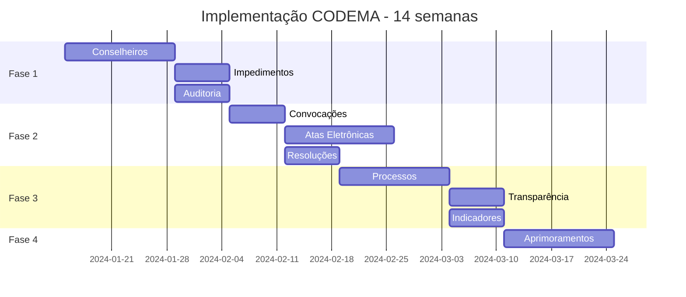

# Sistema de Gestão do CODEMA - Planejamento Completo

## Visão Geral

O Sistema de Gestão do CODEMA (Conselho Municipal de Defesa do Meio Ambiente) de Itanhomi precisa atender 12 módulos essenciais fundamentados na legislação municipal (Lei 1.234/2002), estadual e federal.

## Análise Comparativa: Requisitos Legais vs Sistema Atual

### ✅ Módulos Já Implementados (Parcialmente)

| Módulo | Requisito Legal | Status Atual | Gaps Identificados |
|--------|-----------------|--------------|-------------------|
| **2. Agenda e Convocações** | Sistema de convocação com 7 dias de antecedência | Página de Reuniões existe | Falta: sistema automatizado de convocação, integração email/WhatsApp, confirmação de presença |
| **5. Protocolo e Tramitação** | Processos com prazo de 30 dias | Página de Processos existe | Falta: numeração automática, alertas de prazo, fluxo de tramitação |
| **6. Gestão do FMA** | Controle de receitas e projetos | Página FMA existe | Falta: relatórios trimestrais, integração com TCE-MG |
| **7. Biblioteca de Documentos** | Guarda digital com busca | Página Documentos existe | Falta: categorização completa, busca avançada |
| **9. Módulo de Ouvidoria** | Denúncias ambientais | Página Ouvidoria existe | Falta: anonimização, geolocalização, acompanhamento |

### ❌ Módulos Não Implementados

| Módulo | Requisito Legal | Justificativa Legal |
|--------|-----------------|-------------------|
| **1. Cadastro de Conselheiros** | Gestão de mandatos e faltas | Lei 1.234/2002, art. 6º |
| **3. Lavratura Eletrônica de Atas** | Atas com assinatura digital | Lei Orgânica art. 88; Lei 14.063/2020 |
| **4. Controle de Resoluções** | Numeração e publicação | Lei 1.234/2002, art. 15 |
| **8. Portal da Transparência** | Publicação automática | Lei 12.527/2011 (LAI) |
| **10. Painel de Indicadores** | KPIs e relatórios | Lei Orgânica art. 250 § 1º |
| **11. Controle de Impedimentos** | Conflitos de interesse | Res. CONAMA 237/1997, art. 20 |
| **12. Logs de Auditoria** | Rastreabilidade | TCE-MG e LGPD |

## Arquitetura de Integração

### 1. Estrutura de Dados Existente
```
profiles (usuários) ─┬─> reunioes ──> presencas
                    ├─> processos ──> tramitacoes
                    ├─> documentos
                    ├─> fma_receitas/projetos
                    └─> ouvidoria_denuncias
```

### 2. Estrutura Proposta (Adições)
```
profiles ─┬─> conselheiros ──> mandatos
          │                 └─> impedimentos
          ├─> convocacoes ──> confirmacoes
          ├─> atas_eletronicas ──> assinaturas
          ├─> resolucoes ──> votacoes
          └─> audit_logs
```

## Estratégia de Implementação

### Fase 1: Fundação (4 semanas)
1. **Módulo 1 - Cadastro de Conselheiros**
   - Criar interface sobre a tabela profiles existente
   - Adicionar campos específicos: mandato, entidade, segmento
   - Sistema de alertas para mandatos expirando

2. **Módulo 11 - Controle de Impedimentos**
   - Integrar com cadastro de conselheiros
   - Validação automática em votações

3. **Módulo 12 - Logs de Auditoria**
   - Implementar middleware de logging
   - Interface de consulta para TCE

### Fase 2: Gestão de Reuniões (4 semanas)
1. **Aprimorar Módulo 2 - Convocações**
   - Adicionar à página de Reuniões existente
   - Integração com email/SMS
   - Sistema de confirmação de presença

2. **Módulo 3 - Atas Eletrônicas**
   - Editor rico para atas
   - Integração com assinatura digital (gov.br)
   - Exportação PDF/A

3. **Módulo 4 - Resoluções**
   - Sistema de numeração automática
   - Fluxo de votação
   - Publicação automática

### Fase 3: Processos e Transparência (4 semanas)
1. **Aprimorar Módulo 5 - Processos**
   - Adicionar numeração automática
   - Sistema de alertas de prazo
   - Fluxo de tramitação visual

2. **Módulo 8 - Portal da Transparência**
   - Página pública com todos os dados
   - Alimentação automática
   - e-SIC integrado

3. **Módulo 10 - Painel de Indicadores**
   - Dashboard analítico
   - Relatórios exportáveis
   - Integração com todos os módulos

### Fase 4: Aprimoramentos (2 semanas)
1. **Melhorias no FMA**
   - Relatórios trimestrais automáticos
   - Export para TCE-MG

2. **Melhorias na Ouvidoria**
   - Geolocalização
   - App mobile (PWA)

3. **Melhorias em Documentos**
   - OCR para busca
   - Versionamento

## Tecnologias e Integrações

### Novas Dependências Necessárias
- **Assinatura Digital**: @govbr/assinador
- **Email/SMS**: @sendgrid/mail ou AWS SES
- **Geolocalização**: @react-google-maps/api
- **PDF/A**: jsPDF com plugin PDF/A
- **OCR**: Tesseract.js
- **Gráficos**: Recharts (já instalado)

### Integrações Externas
1. **gov.br** - Assinatura digital (ICP-Brasil)
2. **TCE-MG** - Export de dados
3. **WhatsApp Business** - Notificações
4. **Google Maps** - Geolocalização

## Considerações de Segurança e Compliance

### LGPD (Lei 13.709/2018)
- Anonimização de denúncias
- Consentimento para notificações
- Direito ao esquecimento
- Logs de acesso a dados pessoais

### LAI (Lei 12.527/2011)
- Todos os dados públicos por padrão
- Exceção apenas para dados pessoais
- Prazo de resposta: 20 dias
- Recurso em caso de negativa

### Auditoria TCE-MG
- Logs imutáveis de todas as ações
- Backup diário com retenção de 5 anos
- Trilha de auditoria completa
- Relatórios em formato aberto

## Métricas de Sucesso

### Técnicas
- 100% de cobertura dos requisitos legais
- Tempo de resposta < 2s
- Disponibilidade > 99.5%
- Zero vulnerabilidades críticas

### Negócio
- Redução de 80% no tempo de tramitação
- 100% das atas publicadas em 48h
- Zero multas por descumprimento da LAI
- Satisfação dos conselheiros > 90%

## Riscos e Mitigações

| Risco | Probabilidade | Impacto | Mitigação |
|-------|---------------|---------|-----------|
| Resistência à mudança | Alta | Médio | Treinamento e suporte |
| Integração gov.br complexa | Média | Alto | POC antecipada |
| Prazo apertado | Alta | Alto | Priorização por valor legal |
| Orçamento limitado | Média | Médio | Fases incrementais |

## Cronograma Macro



## Próximos Passos

1. Validar prioridades com stakeholders
2. Criar protótipos das interfaces críticas
3. POC de integração com gov.br
4. Definir SLAs com fornecedores
5. Planejar treinamento dos usuários