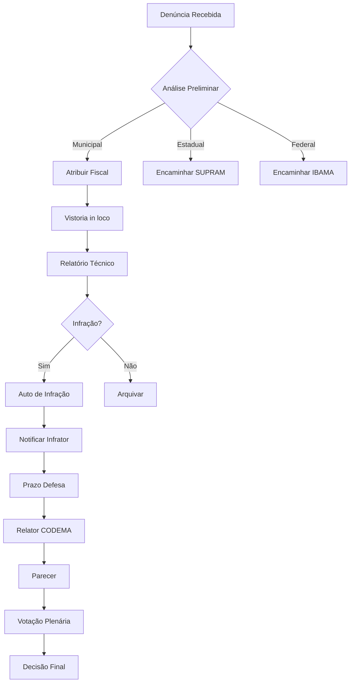

## 3) Status Atual da Implementação ✅

### Funcionalidades já implementadas:
- ✅ Registro de denúncias (anônimas ou identificadas)
- ✅ Níveis de prioridade (baixa, normal, alta, urgente)
- ✅ Status de tramitação (recebida, em_apuracao, fiscalizacao_agendada, etc.)
- ✅ Atribuição de fiscal responsável
- ✅ Relatórios de fiscalização
- ✅ Geração automática de protocolo
- ✅ Busca e filtros básicos
- ✅ Cards estatísticos operacionais
- ✅ Interface responsiva

### Modelo de dados atual:
Tabela principal: `ouvidoria_denuncias`
- id (uuid)
- protocolo (string)
- tipo_denuncia (string)
- descricao (text)
- local_ocorrencia (text)
- latitude (numeric | null)
- longitude (numeric | null)
- data_ocorrencia (timestamp | null)
- denunciante_nome/cpf/telefone/email (opcional; omitidos se anônima)
- anonima (boolean)
- prioridade (string)
- status (string)
- fiscal_responsavel_id (uuid | null)
- relatorio_fiscalizacao (text | null)
- data_fiscalizacao (timestamp | null)
- created_at (timestamp), updated_at (timestamp)

## 4) Plano de Implementação - 3 Fases 🚀

### **FASE 1: Funcionalidades Críticas (Prioridade Alta - 2-3 semanas)**

#### 1.1 Sistema de Anexos e Evidências 📎
- **Objetivo**: Permitir upload de fotos/documentos como evidências
- **Implementação**:
  - Adicionar campo `anexos` (array de URLs) na tabela
  - Integrar com Supabase Storage
  - Componente de upload com preview e validação (max 10MB)
  - Hash SHA-256 para garantir integridade dos arquivos
- **Compliance**: Cadeia de custódia digital para evidências

#### 1.2 Sistema de Notificações por Email 📧
- **Objetivo**: Notificar automaticamente mudanças de status
- **Implementação**:
  - Criar tabela `notificacoes_ouvidoria`
  - Templates de email para cada status
  - Integração com SendGrid/Resend
  - Preferências de notificação por usuário
- **Compliance**: Lei 12.527/2011 (LAI) - transparência

#### 1.3 Timeline de Eventos 📅
- **Objetivo**: Rastrear histórico completo da denúncia
- **Implementação**:
  - Criar tabela `ouvidoria_historico`
  - Componente visual de timeline
  - Registro automático de todas alterações
  - Exibição na página de detalhes
- **Compliance**: Auditoria completa para accountability

#### 1.4 SLA e Prazos Legais ⏰
- **Objetivo**: Garantir cumprimento de prazos legais
- **Implementação**:
  - Campos de prazo (prazo_resposta, prazo_vistoria)
  - Cálculo automático baseado em prioridade
  - Indicadores visuais (verde/amarelo/vermelho)
  - Alertas automáticos
- **Prazos Legais**:
  - Resposta inicial: 30 dias (Lei 12.527/2011)
  - Vistoria urgente: 48 horas
  - Parecer técnico: 15 dias após vistoria

#### 1.5 Página de Detalhes e Gerenciamento 🔍
- **Objetivo**: Interface completa para gestão de denúncias
- **Implementação**:
  - Rota `/ouvidoria/:id`
  - Modal de gerenciamento para fiscais
  - Formulários de atualização
  - Seção de relatório de fiscalização

### **FASE 2: Melhorias de Produtividade (Prioridade Média - 3-4 semanas)**

#### 2.1 Portal Público de Denúncias 🌐
- **Objetivo**: Facilitar denúncias por cidadãos
- **Implementação**:
  - Rota pública `/denuncia-publica`
  - Formulário simplificado sem autenticação
  - Captcha anti-spam
  - Consulta por protocolo

#### 2.2 Filtros Avançados e Exportação 📊
- **Objetivo**: Melhorar análise e relatórios
- **Implementação**:
  - Filtros por período/tipo/bairro/fiscal
  - Exportação CSV/Excel
  - Relatórios gerenciais com gráficos
  - Paginação eficiente

#### 2.3 Painel do Fiscal 👮
- **Objetivo**: Dashboard específico para fiscais
- **Implementação**:
  - Lista de tarefas atribuídas
  - Calendário de vistorias
  - Métricas de desempenho
  - Notificações prioritárias

#### 2.4 Integração com Mapas 🗺️
- **Objetivo**: Visualização geográfica das denúncias
- **Implementação**:
  - Mapa interativo (Leaflet/Mapbox)
  - Pins coloridos por status
  - Busca por proximidade
  - Camadas de áreas protegidas

### **FASE 3: Recursos Avançados (Longo Prazo - 4-6 semanas)**

#### 3.1 Integração WhatsApp Business 💬
- **Objetivo**: Receber denúncias via WhatsApp
- **Implementação**:
  - Webhook para receber mensagens
  - Bot para registro automático
  - Respostas automáticas
  - Notificações de status

#### 3.2 Assinatura Digital ✍️
- **Objetivo**: Validação legal de documentos
- **Implementação**:
  - Integração DocuSign/Clicksign
  - Assinatura de relatórios
  - Certificação de documentos
  - Arquivo digital seguro

#### 3.3 Dashboard Gerencial com Mapa de Calor 📈
- **Objetivo**: Análise gerencial avançada
- **Implementação**:
  - Visualização de densidade
  - Análise temporal e tendências
  - KPIs e métricas de eficiência
  - Relatórios automatizados

## 5) Requisitos de Conformidade Legal ⚖️

### 5.1 Classificação Legal CONAMA
- Categorização baseada na Resolução CONAMA 237/1997
- Fundamentação legal obrigatória
- Sistema de auto de infração integrado

### 5.2 Proteção de Dados (LGPD - Lei 13.709/2018)
- Criptografia AES-256 para dados sensíveis
- Termo de consentimento explícito
- Sistema de anonimização aprimorado
- Logs de auditoria detalhados
- Direito ao esquecimento

### 5.3 Integração com Órgãos Ambientais
- APIs para SISNAMA/SISEMA-MG
- Escalação para competências estaduais/federais
- Consulta automática ao CAR
- Notificação IBAMA/SUPRAM quando aplicável

### 5.4 Prazos Legais Obrigatórios
```typescript
interface PrazosLegais {
  resposta_inicial: 30,        // dias - Lei 12.527/2011
  analise_preliminar: 10,      // dias - interno
  vistoria_urgente: 48,        // horas - casos urgentes
  elaboracao_parecer: 15,      // dias após vistoria
  notificacao_infrator: 5,     // dias após constatação
  prazo_defesa: 20,           // dias para defesa
  julgamento_codema: 60       // dias para decisão
}
```

## 6) Fluxo Operacional Completo



## 7) Estrutura de Arquivos a Criar

```
src/
├── pages/ouvidoria/
│   ├── OuvidoriaDetails.tsx      # Página de detalhes
│   ├── OuvidoriaPublic.tsx       # Portal público
│   └── FiscalDashboard.tsx       # Painel do fiscal
├── components/ouvidoria/
│   ├── FileUpload.tsx            # Upload de arquivos
│   ├── Timeline.tsx              # Timeline de eventos
│   ├── SLAIndicator.tsx          # Indicador de SLA
│   ├── DenunciaMap.tsx           # Mapa de denúncias
│   └── NotificationPrefs.tsx     # Preferências
├── hooks/
│   ├── useOuvidoriaNotifications.ts
│   ├── useOuvidoriaHistory.ts
│   └── useOuvidoriaSLA.ts
├── services/
│   ├── emailService.ts           # Serviço de email
│   ├── whatsappService.ts        # WhatsApp API
│   └── mapService.ts             # Serviço de mapas
└── utils/
    ├── slaCalculator.ts          # Cálculo de SLA
    └── legalClassification.ts    # Classificação CONAMA
```

## 8) Migrações do Banco de Dados

```sql
-- 1. Adicionar anexos
ALTER TABLE ouvidoria_denuncias 
ADD COLUMN anexos TEXT[] DEFAULT '{}';

-- 2. Criar histórico
CREATE TABLE ouvidoria_historico (
  id UUID PRIMARY KEY DEFAULT gen_random_uuid(),
  denuncia_id UUID REFERENCES ouvidoria_denuncias(id),
  usuario_id UUID REFERENCES profiles(id),
  acao TEXT NOT NULL,
  descricao TEXT,
  dados_anteriores JSONB,
  dados_novos JSONB,
  created_at TIMESTAMP WITH TIME ZONE DEFAULT now()
);

-- 3. Adicionar SLA
ALTER TABLE ouvidoria_denuncias
ADD COLUMN prazo_resposta TIMESTAMP WITH TIME ZONE,
ADD COLUMN prazo_vistoria TIMESTAMP WITH TIME ZONE,
ADD COLUMN sla_status TEXT CHECK (sla_status IN ('no_prazo', 'atencao', 'vencido'));

-- 4. Notificações
CREATE TABLE notificacoes_ouvidoria (
  id UUID PRIMARY KEY DEFAULT gen_random_uuid(),
  denuncia_id UUID REFERENCES ouvidoria_denuncias(id),
  destinatario_email TEXT NOT NULL,
  tipo TEXT NOT NULL,
  status TEXT DEFAULT 'pendente',
  tentativas INTEGER DEFAULT 0,
  enviado_em TIMESTAMP WITH TIME ZONE,
  created_at TIMESTAMP WITH TIME ZONE DEFAULT now()
);
```

## 9) Cronograma de Implementação

### Sprint 1 (Semana 1)
- [ ] Sistema de anexos
- [ ] Timeline de eventos
- [ ] Página de detalhes

### Sprint 2 (Semana 2)
- [ ] Notificações por email
- [ ] SLA e indicadores

### Sprint 3 (Semana 3)
- [ ] Portal público
- [ ] Filtros avançados

### Sprint 4 (Semana 4)
- [ ] Painel do fiscal
- [ ] Integração com mapas

### Sprint 5 (Semanas 5-6)
- [ ] WhatsApp integration
- [ ] Dashboard gerencial
- [ ] Conformidade legal

## 10) Métricas de Sucesso

- **Tempo médio de resposta**: < 5 dias
- **Taxa de resolução**: > 80%
- **SLA cumprido**: > 95%
- **Satisfação do denunciante**: > 4/5
- **Denúncias via portal público**: > 50%

## 11) Próximos Passos Imediatos

1. **Criar branch de desenvolvimento**: `git checkout -b feature/ouvidoria-fase-1`
2. **Implementar migrações do banco**: Sistema de anexos e histórico
3. **Desenvolver componente FileUpload**: Upload seguro com preview
4. **Criar página OuvidoriaDetails**: Visualização completa
5. **Implementar sistema de notificações**: Templates e envio

## 12) Considerações de Segurança

- **Anonimato garantido**: Hash único para acompanhamento sem exposição
- **Criptografia de dados sensíveis**: AES-256 para CPF, telefone, email
- **Segregação de acesso**: Níveis diferenciados por role
- **Proteção contra retaliação**: Modo protegido para denunciantes vulneráveis
- **Auditoria completa**: Log de todas as ações com justificativa
